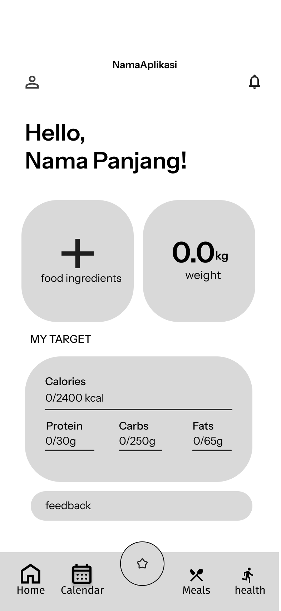

# IMPAL Healthy Meal Recommender

Aplikasi rekomendasi makanan sehat berbasis AI dan mobile untuk membantu pengguna mendapatkan saran menu harian yang disesuaikan dengan kebutuhan nutrisi dan preferensi pribadi.

Proyek ini dibuat untuk memenuhi **Tugas Mata Kuliah IMPLEMENTASI DAN PENGUJIAN PERANGKAT LUNAK** (BS1IF-48-PJJ-01).

<p align="center">
  
</p>

## Fitur

- Autentikasi pengguna melalui login dan registrasi akun
- Pengelolaan profil fisik dan target kalori harian
- Pengaturan preferensi diet dan pantangan alergi
- Perhitungan otomatis BMR dan rincian makronutrisi
- Manajemen inventaris stok bahan makanan dengan filter sortir
- Chatbot interaktif berbasis AI untuk rekomendasi menu
- Generator menu harian dan perencanaan jadwal makan
- Riwayat menu dan log berat badan berbasis kalender
- Pelacak asupan air harian dan target hidrasi   Formulir umpan balik aplikasi dan pelaporan kendala 

## Struktur Repositori

```text
├── client/          # Frontend mobile app (Expo React Native, TypeScript)
├── server/          # Backend REST API (Node.js, Express, MySQL, OpenRouter AI)
├── docs/            # Dokumen proyek (week-1, week-2, SKPL, DPPL)
├── LICENSE          # Lisensi proyek (MIT License)
└── README.md
```

## Tech Stack

- **Mobile Client:** Expo (React Native), TypeScript
- **Backend Server:** Node.js, Express.js, MySQL
- **AI Service:** OpenAI API / Custom AI Gateway
- **Documentation:** SKPL (SRS) & DPPL (SDD)

## Anggota Kelompok

| NIM | Nama | Role | GitHub |
| :---: | :--- | :--- | :--- |
| `103042400013` | Muhammad Haiqal | -- | [@iqoll](https://github.com/iqoll) |
| `103042310118` | Christine Mako | -- | [@christinemako](https://github.com/christinemako) |
| `103042310017` | Yuri Mahdi Prasetya | -- | [@yuri114](https://github.com/yuri114) |
| `1304221036` | Muhammad Fathan Yusrizal | -- | [@killerbawang](https://github.com/killerbawang) |
| `103042400058` | Siti Robiah | -- | [@sitirobiah](https://github.com/sitirobiah) |

## Dokumentasi Proyek

Dokumen perancangan dan pengujian sistem dapat diakses pada folder berikut:

- [Dokumen SKPL (SRS)](./docs/week-2/SKPL.pdf)
- [Dokumen DPPL](./docs/week-2/DPPL.pdf)

## Getting Started

### Prasyarat

- [Node.js](https://nodejs.org/) (LTS)
- [Expo Go](https://expo.dev/go) aplikasi, atau emulator Android/iOS

### Instalasi

```bash
git clone https://github.com/iqoll/IMPAL-healthy-meal-recommender.git
cd IMPAL-healthy-meal-recommender
npm install
```

### Menjalankan Aplikasi

```bash
npx expo start
```

Pindai kode QR menggunakan aplikasi Expo Go (Android) atau aplikasi Kamera (iOS) untuk menjalankannya di perangkat Anda.

## License

MIT
